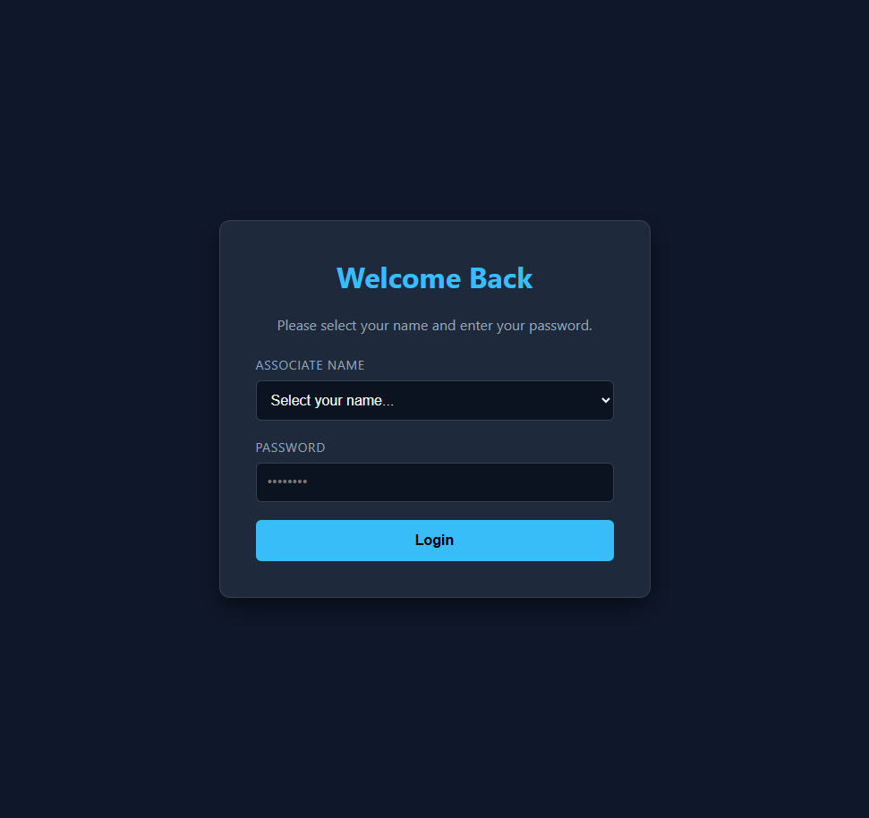
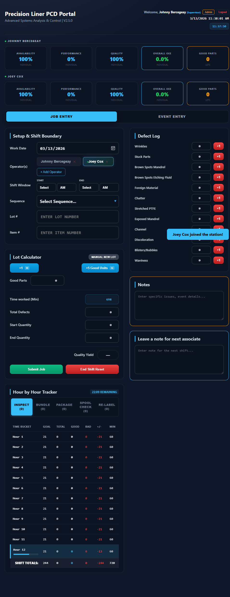
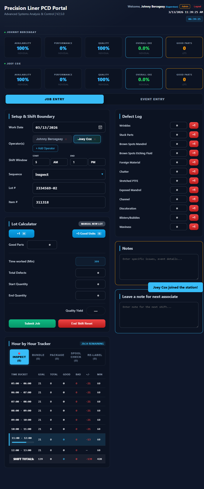
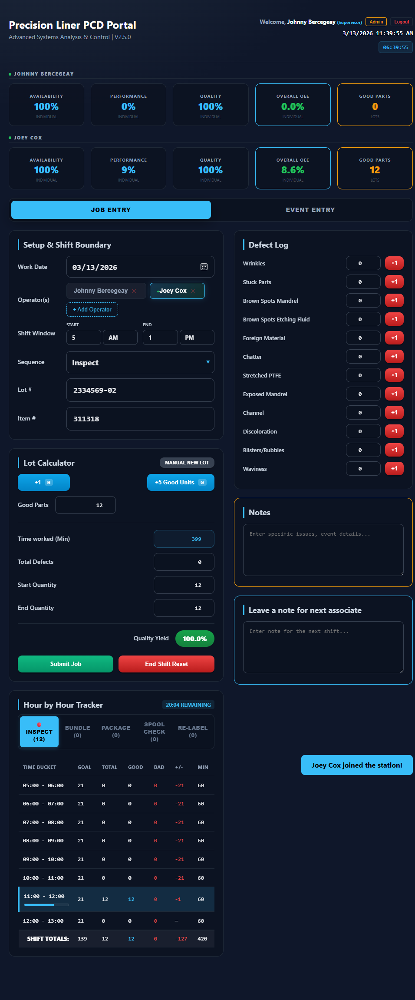
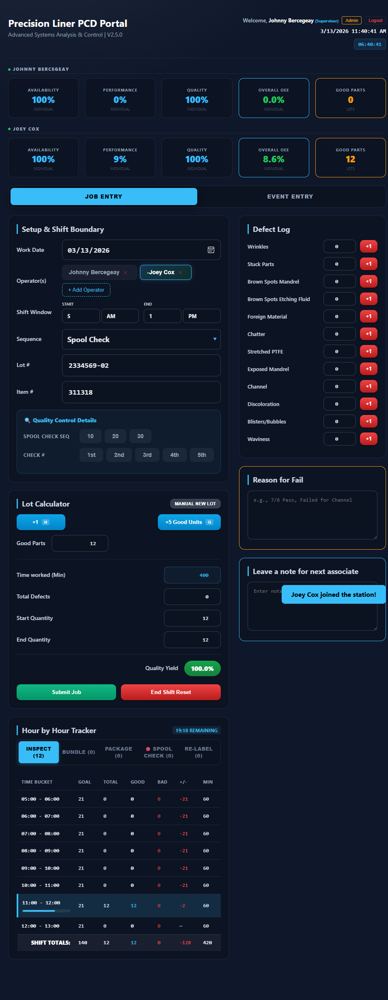
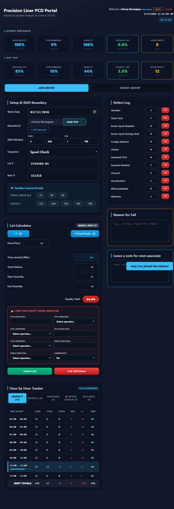
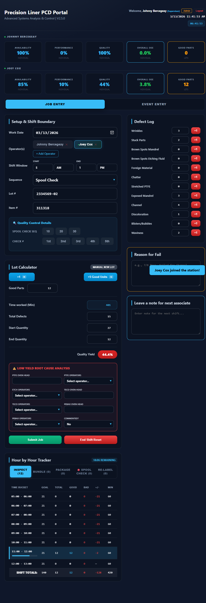
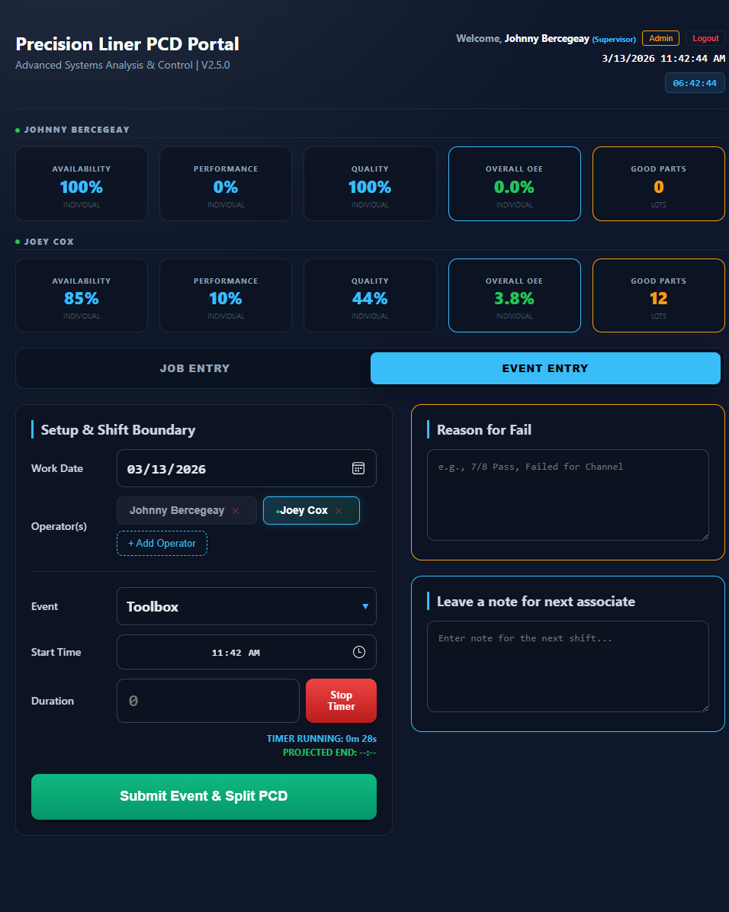

# Precision Liner PCD Portal — Associate Standard Operating Procedure (SOP)

**Document Version:** 2.0  
**Effective Date:** March 13, 2026  
**Application Version:** V2.5.0  
**Prepared For:** Associate Training Class

---

## Purpose

This SOP provides step-by-step instructions for using the **Precision Liner PCD Portal** as an Associate. The portal tracks production data, logs downtime events, records defects, and continuously synchronizes with our production tracking system in the background.

---

## Table of Contents

1. [Logging In & Account Setup](#1-logging-in--account-setup)
2. [Multi-User Kiosk Mode (Shared Stations)](#2-multi-user-kiosk-mode-shared-stations)
3. [Shift Setup](#3-shift-setup)
4. [Job Entry Mode — Logging Production](#4-job-entry-mode--logging-production)
5. [Spool Check QC Details](#5-spool-check-qc-details)
6. [Recording Defects & Low Yield RCA](#6-recording-defects--low-yield-rca)
7. [Reading the PCD Tracker & KPIs](#7-reading-the-pcd-tracker--kpis)
8. [Submitting a Job](#8-submitting-a-job)
9. [Event Entry Mode (Downtime)](#9-event-entry-mode-downtime)
10. [End of Shift Procedure](#10-end-of-shift-procedure)
11. [Troubleshooting & FAQ](#11-troubleshooting--faq)

---

## 1. Logging In & Account Setup

  
*(Above: The portal login and account setup screen)*

**First Time setup:**
1. Open the portal in your browser.
2. If you do not have a password configured, the portal will prompt you to create one.
3. Select your name from the **Associate Name** dropdown.
4. Click **Set Up Account** (Green button).
5. Enter a new password (minimum 6 characters) and confirm it.
6. Click **Save & Login**.

**Daily Login:**
1. Select your name from the **Associate Name** dropdown.
2. Enter your password.
3. Click **Login** (Blue button).

---

## 2. Multi-User Kiosk Mode (Shared Stations)

  
*(Above: The operator bar showing multiple signed-in associates)*

The portal supports multiple associates working at the same physical computer or tablet. Each associate's data is tracked independently!

### Adding an Operator to the Station
1. Click the **+ Add Operator** button in the Operator Bar.
2. Select the associate's name from the dropdown.
3. They must enter their personal password to join the station.
4. Click **Confirm**.

### Switching Between Operators
- Click your name in the **Operator Bar** to switch to your workspace.
- The button will turn green/blue to indicate your workspace is active.
- **CRITICAL:** Always verify your name is highlighted before clicking "+1 Good Unit" or adding defects.

### Removing an Operator (Signing Out Early)
- Click the small red **"X"** next to your name in the Operator Bar.
- Any active work will be saved, but you will be completely signed out of the station.

---

## 3. Shift Setup

  
*(Above: Configuring Shift Window, Sequence, and Lot details)*

Before logging production, ensure your shift details are accurate:

1. **Work Date & Shift Window:** Verify the date and shift start/end times.
   - The default window is **5:00 AM – 1:00 PM**. Adjust this if you are working a modified or off-shift.
2. **Operator:** Guarantee your name is currently selected in the Kiosk Bar.
3. **Sequence:** Select your active process (e.g., Inspect, Bundle, Package, Spool Check, Re-Label).
4. **Lot # & Item #:** Accurately type the lot and item numbers you are actively running.

*(Note: Failing to select a valid Shift Window will prevent the Hour-by-Hour tracker from generating properly).*

---

## 4. Job Entry Mode — Logging Production

  
*(Above: The +1 and +5 counting buttons for production)*

This is your primary screen for counting good production parts.

- Click **"+1"** to add a single part (Shortcut: Press keyboard letter **H**).
- Click **"+5 Good Units"** to add multiple parts quickly (Shortcut: Press keyboard letter **G**).
- Recorded parts are instantly saved to your workspace and assigned to the current hour bucket in the PCD Tracker.

---

## 5. Spool Check QC Details

  
*(Above: Options that appear only when "Spool Check" sequence is selected)*

If your active Sequence is **Spool Check**, a special quality control section will appear.

1. **Spool Check Seq:** Select the stage of the spool check (10, 20, or 30).
2. **Check #:** Select which check sequence this is (1st, 2nd, 3rd, 4th, or 5th).
3. These selections are passed along with your job submission for Quality Analytics.

---

## 6. Recording Defects & Low Yield RCA

  
*(Above: The Defect Log list and the Red RCA section that appears on low yield)*

### Logging Defects
- Find the specific defect type in the right-hand **Defect Log** column.
- Click the **+1** button next to it.
- Defects lower your Overall Equipment Effectiveness (OEE) and Quality Yield metrics.

### Low Yield Root Cause Analysis (RCA)
- If your Quality Yield drops to **50% or below**, a red RCA section will automatically display beneath the Lot Calculator.
- **You are required to complete this section.** It captures equipment heads and previous operators responsible for the underlying defect.
- Select the equipment tags and operator names from the drop-downs provided before you submit the job.

---

## 7. Reading the PCD Tracker & KPIs

  
*(Above: The Hour-by-Hour Tracker showing production pacing)*

### The PCD Tracker
The table breaks down your progress against the expected goal (Takt Time) broken out into hourly segments.
- **Green numbers (+):** You are ahead of schedule.
- **Red numbers (-):** You are falling behind schedule.
- The highlighted row indicates the current, active hour.

### The KPI Display
At the top of the portal, 5 metrics track overall health:
- **Availability:** Time producing vs. Time down.
- **Performance:** Speed vs. Goal Target.
- **Quality:** Good vs. Bad parts ratio.
- **Overall OEE:** The multiplicative score of the 3 metrics above.
- **Shift Good Parts:** Total volume for the entire shift.

---

## 8. Submitting a Job

When you finish a lot (or sequence step) and need to transition to a new one:

1. Confirm the Kiosk Bar has your name selected.
2. Confirm the **Lot #** and **Item #** are correct.
3. Click the green **Submit Job** button.
4. The system will submit your production cleanly to the backend database via an automated API.
5. **Important Change:** You NO LONGER need to manually click Submit on a Smartsheet web form! The portal handles everything entirely in the background. Once the notification says "Saved," you are done.
6. The app will automatically clear your production counts to begin the next lot.

---

## 9. Event Entry Mode (Downtime)

  
*(Above: Submitting a downtime event with the integrated timer)*

Use the Event Entry mode to log Breaks, Clean-Up, Meetings, or general machine downtime.

1. Toggle the Top Switch from **Job Entry** to **Event Entry**.
2. Select the specific **Event** type from the dropdown.
3. **Using the Timer:** Click **Start Timer** when the delay begins. Click **Stop Timer** when you resume work.
4. **Manual Entry:** Alternatively, you can type the total downtime directly into the Duration box.
5. Click **Submit Event & Split PCD**.
6. 💸 The time will automatically be subtracted from your productive available capacity (PCD tracker minutes) allowing you to protect your Performance scores when conditions are out of your control.

---

## 10. End of Shift Procedure

The following sequence **must** be completed at the end of every operating shift to finalize your portal tracking and release the physical kiosk:

1. **Submit Active Lots:** If you have any current production counted, click **Submit Job** to send that lot.
2. **Leave a Note:** Fill out the *Leave a note for next associate* text box with any machine anomalies, pass-downs, or material status details.
3. Click the red **End Shift Reset** button.
4. A prompt will ask you to confirm. When you hit confirm, the system will execute a background API call that submits your full hour-by-hour tracker to the database.
5. Upon success, you are securely signed out of the kiosk. Your pass-down note is queued for the incoming associate.

*(Note: The End Shift button will begin visibly pulsing 15 minutes before your scheduled drop-dead shift end time).*

---

## 11. Troubleshooting & FAQ

**Q: "I added extra parts by mistake. Can I remove them?"**
A: Yes. You can manually type over the numerical values in your Good Parts input box to correct misclicks. 

**Q: "The End Shift Reset button tells me I must Submit Active Lot First."**
A: The portal will prevent you from accidentally abandoning recorded parts. Click "Submit Job" to push that partially finished lot up to the server, and then you can firmly End Shift.

**Q: "Where are the Smartsheet forms opening?"**
A: We have upgraded! V2.5.0 features fully integrated server side APIs. You will no longer encounter intrusive popup tabs for Smartsheet. If you see the Green confirmation Toast alert from the portal, the data successfully reached Smartsheet.

**Q: What if I lose internet connection?**
A: The portal retains your active workspace and calculations locally on the device for your designated kiosk slot. Do not clear your browser history. Restoring connection and hitting submit will synchronize properly.

---
*End of Associate SOP.*
