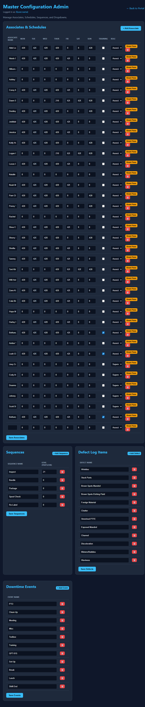
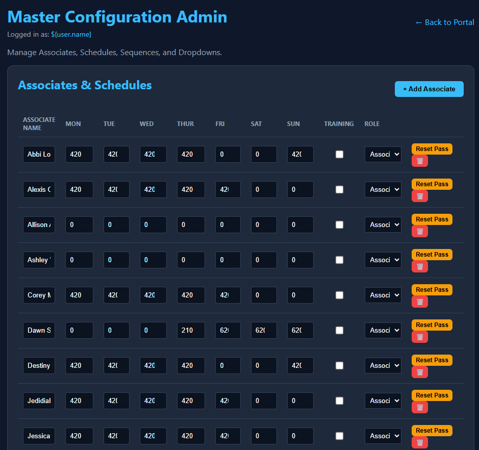
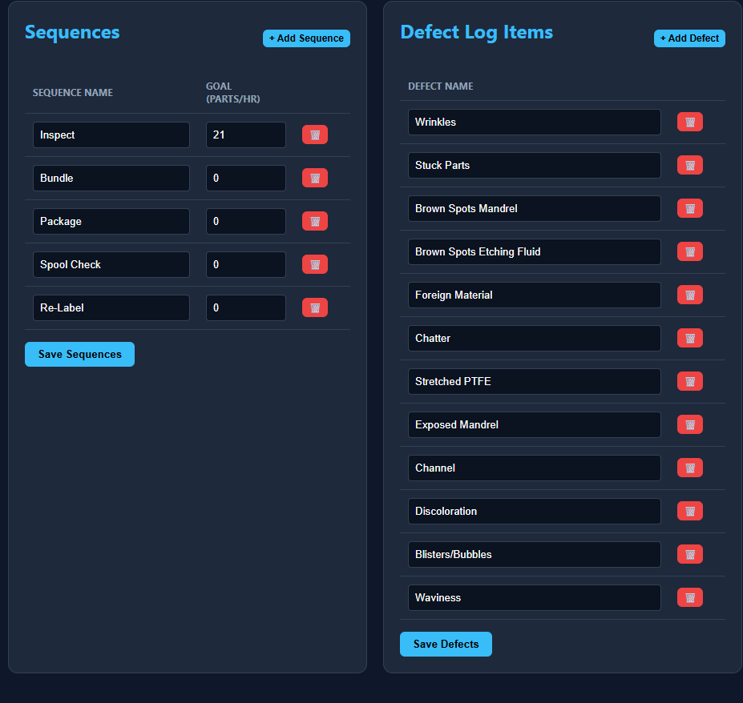
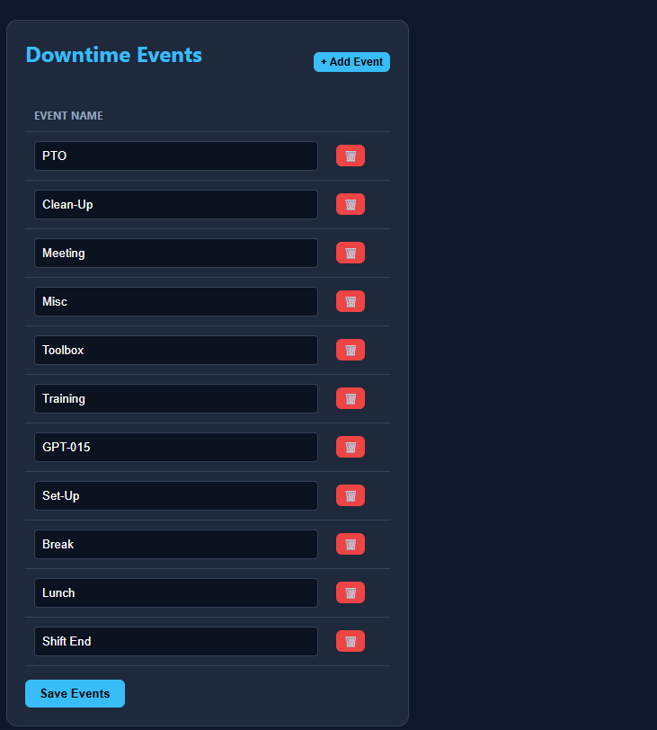

# Precision Liner PCD Portal — Supervisor/Admin SOP

**Document Version:** 1.0  
**Effective Date:** March 13, 2026  
**Application Version:** V2.5.0  

---

## Purpose

This SOP covers the Master Configuration Admin panel. As a supervisor, you will use this interface to manage employee access, edit downtime/defect categories, and configure production goals. All changes made in the Admin panel sync directly to the master Smartsheet backend using background API calls.

---

## Table of Contents

1. [Accessing the Admin Panel](#1-accessing-the-admin-panel)
2. [Managing Associates & Schedules](#2-managing-associates--schedules)
3. [Managing Sequences & Goals](#3-managing-sequences--goals)
4. [Managing Defects & Events](#4-managing-defects--events)

---

## 1. Accessing the Admin Panel

  
*(Above: The Supervisor Admin Panel)*

1. Log into the Precision Liner portal normally.
2. If your account `Role` is set to **Supervisor**, you will see an **Admin** button in the top right corner of the dashboard next to your name.
3. Click **Admin** to open the Master Configuration page.

*(Note: If you do not see the Admin button, your account does not have Supervisor privileges. Contact a system administrator to update your role in Smartsheet).*

---

## 2. Managing Associates & Schedules

  
*(Above: The Associates & Schedules configuration table)*

This section allows you to onboard new associates, define their scheduled hours, and manage access.

### Adding a New Associate
1. Click **+ Add Associate**.
2. A new blank row will appear at the bottom of the table.
3. Enter their **Associate Name**.
4. Set their scheduled hours for each day of the week (Mon-Sun).
5. Toggle the **Training** checkbox if they are currently in training.
6. Set their **Role** to *Associate* or *Supervisor*.
7. Click the blue **Save Associates** button at the bottom of the table to push the new user to Smartsheet.

### Resetting an Associate's Password
If an associate forgets their password:
1. Locate their name in the table.
2. Click the yellow **Reset Pass** button.
3. Confirm the prompt.
4. The associate will be forced to create a new secure password on their next login attempt.

### Deleting an Associate
1. Click the red trashcan (**🗑️**) next to the associate's name.
2. Confirm the prompt to permanently delete their record from Smartsheet.

---

## 3. Managing Sequences & Goals

  
*(Above: The Sequences configuration table)*

Sequences dictate the Takt Time (pieces per hour) expected from the operator.

1. Review the list of active sequences (e.g., Inspect, Bundle, Package).
2. To modify a goal, click the number under **Goal (Parts/Hr)** and type the new target.
3. To add a new sequence process, click **+ Add Sequence** and fill out the name and goal.
4. Click **Save Sequences** to apply the changes globally.

---

## 4. Managing Defects & Events

  
*(Above: The Defects and Events configuration tables)*

The portal dynamically generates its dropdowns and defect buttons from these lists.

### Defect Log Items
1. To track a new type of defect, click **+ Add Defect**.
2. Type the name (e.g., "Core Damage").
3. Click **Save Defects**.
4. This new defect will instantly appear on all active operator dashboards.

### Downtime Events
1. To add a new downtime reason (e.g., "Material Shortage"), click **+ Add Event**.
2. Type the new event name.
3. Click **Save Events**.
4. The new event will populate in the Event Entry dropdown for all operators.

---
*End of Supervisor SOP.*
